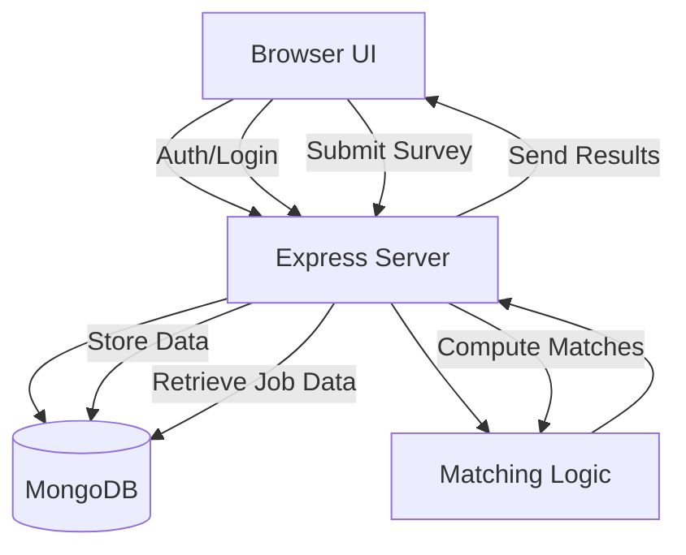
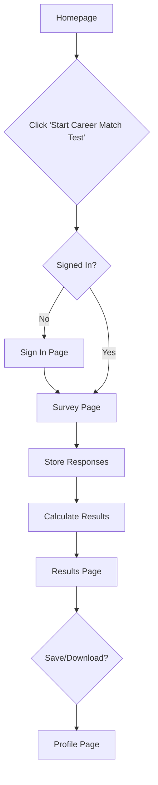

# CareerCompass

## 1. Project Overview

CareerCompass is a web application designed to help undergraduate students discover suitable career paths. The application collects user data regarding education, technical and soft skills, industry interests, and personality type (MBTI) through an interactive assessment. It processes this data to output top career matches accompanied by detailed explanations, salary insights, and identification of skill gaps. The primary goal is to provide actionable career recommendations to students who feel uncertain about their post-graduation path.

## 2. Product Features (By Webpage)

### Homepage
*   **Status**: Implemented.
*   **Purpose**: Landing page to introduce value propositions and entry point for the assessment.
*   **Key UI/UX**: Hero section with call-to-action, value cards, "How It Works" steps, and sample deliverables.
*   **Interactions**: Navigation links, "Start Career Match Test" button.

### FAQs Page
*   **Status**: Planned.
*   **Purpose**: Address common user questions about the assessment method and privacy.
*   **Key UI/UX**: Accordion-style Q&A list.

### Contact Us Page
*   **Status**: Planned.
*   **Purpose**: Allow users to reach out for support or feedback.
*   **Key UI/UX**: Contact form and support email display.

### Sign In Page
*   **Status**: Functional (Login/Register/Log Out).
*   **Purpose**: User authentication.
*   **Key Interactions**: Login form, link to registration.

### My Profile Page
*   **Status**: Functional (Data Fetching Implemented).
*   **Purpose**: View and manage user data and past assessment results.
*   **Key UI/UX**: Dashboard view of user attributes and saved career matches.

### Career Survey Page
*   **Status**: Functional Prototype.
*   **Purpose**: Collect user data for the matching algorithm.
*   **Key UI/UX**: Multi-step or single-page form with autocomplete fields for majors and skills.
*   **Backend Dependencies**: `POST /survey` to save responses.

### Results Page
*   **Status**: Functional Prototype.
*   **Purpose**: Display algorithmic recommendations.
*   **Key UI/UX**: Dynamic result cards showing match score, job description, salary data, and skill gap analysis (Have vs. Need).
*   **Backend Dependencies**: `GET /recommendations/:userId`.

## 3. Tech Stack

### Frontend
*   **HTML/CSS/JavaScript**: Chosen for a lightweight, responsive layout without the overhead of heavy frameworks for this prototype phase.

### Backend
*   **Node.js + Express**: Efficient handling of API requests and JSON data processing.

### Database
*   **MongoDB**:
    *   **Rationale**:
        *   Flexible schema accommodates varying career data structures.
        *   Native compatibility with JSON objects used in the application.
        *   Supports rapid prototyping and evolving data models easier than rigid SQL tables.

## 4. System Architecture Diagram



## 5. User Workflow Diagram



## 6. Database Design

### Collections

**Users**
*   `_id`: ObjectId
*   `email`: String
*   `password_hash`: String
*   `profile_data`: Object (name, etc.)
*   `history`: Array (past results)

**Jobs (Careers)**
*   `title`: String
*   `industry`: String
*   `education_required`: String
*   `technical_skills`: Array[String]
*   `soft_skills`: Array[String]
*   `salary_range`: Object (min, max)
*   `market_demand`: String
*   `growth_rate`: Number

**SurveyResponses**
*   `user_id`: ObjectId (ref: Users)
*   `education`: String
*   `major`: Array[String]
*   `technical_skills`: Array[String]
*   `soft_skills`: Array[String]
*   `industry_pref`: String
*   `work_type`: Array[String]
*   `mbti`: String

## 7. Matching Algorithm

The system uses a rule-based weighted scoring approach:

*   **Mechanism**: Compares user attributes against career requirements.
*   **Weighted Factors**:
    *   **Skills Match** (High Weight): Overlap of technical and soft skills.
    *   **Education**: Minimum education level check.
    *   **Interest Alignment**: Industry and work type (Tech/Non-tech) preferences.
    *   **MBTI Compatibility**: Matching personality type against role suitability.
*   **Output**: Top 3 career matches with detailed skill gap analysis (Skills user has vs. skills user needs).

## 8. Folder Structure

Expected final directory layout:

```
/public
    index.html
    survey.html
    results.html
    faq.html
    contact.html
    signin.html
    profile.html
    main.js
    style.css
    /images
        careers.jpg
        ...

/src
    server.js
    routes/
    models/
    utils/

/data
    careersData.js

README.md
package.json
```

## 9. Image Design Guidelines

*   **Format**: PNG or SVG preferred.
*   **Style**: Modern illustrations with an education/career theme. Simple, friendly, minimal.
*   **Background**: Transparent.
*   **Dimensions**:
    *   Hero images: ~600–700px width.
    *   Card/Icon images: ~150–250px width.

## 10. Installation and Setup

1.  **Install Dependencies**:
    ```bash
    npm install
    ```

2.  **Run Locally**:
    ```bash
    npm run dev
    # OR
    node server.js
    ```
    Server runs on `http://localhost:3001` (default).

## 11. Implementation Status

*   **Completed**:
    *   Homepage UI (locked).
    *   Core backend server setup.
    *   MongoDB connection and automatic data seeding.
    *   Matching logic implementation.
    *   Basic Survey to Results flow.

*   **In Progress**:
    *   Refining Survey and Results UI.
    *   Implementing Auth/Sign In flow.
    *   Building Profile, FAQ, and Contact pages.

## 12. Current Progress

Here is the overview of your current codebase.

1. Codebase Structure Diagram

This ASCII diagram outlines the current file structure and the role of each key component.

APAN5490FinalProject/

├── server.js            # BACKEND: Express server, API endpoints, & matching logic

├── careersData.js       # DATA: JSON dataset used to seed the database

├── package.json         # CONFIG: Dependencies (express, mongoose, cors) & scripts

├── README.md            # DOCS: Project documentation

└── public/              # FRONTEND: Static files served to the browser

    ├── index.html       # -> Landing page (Hero section, Value props)

    ├── survey.html      # -> Survey form (Inputs for skills, education, MBTI)

    ├── results.html     # -> Results page (Displays recommended careers)

    ├── main.js          # -> Client logic (Form submission, Autocomplete, API calls)

    ├── style.css        # -> Global styling

    └── [images...]      # -> Assets (careers.jpg, value1.jpg, etc.)

APAN5490FinalProject/├── server.js            # BACKEND: Express server, API endpoints, & matching logic├── careersData.js       # DATA: JSON dataset used to seed the database├── package.json         # CONFIG: Dependencies (express, mongoose, cors) & scripts├── README.md            # DOCS: Project documentation└── public/              # FRONTEND: Static files served to the browser    ├── index.html       # -> Landing page (Hero section, Value props)    ├── survey.html      # -> Survey form (Inputs for skills, education, MBTI)    ├── results.html     # -> Results page (Displays recommended careers)    ├── main.js          # -> Client logic (Form submission, Autocomplete, API calls)    ├── style.css        # -> Global styling    └── [images...]      # -> Assets (careers.jpg, value1.jpg, etc.)

2. Project Progress Summary

Current Status: Functional Prototype

The codebase represents a complete "Steel Thread" — a fully connected path from frontend user input to backend processing and database storage.

Backend (server.js):

Tech Stack: Node.js, Express, Mongoose.

Data Seeding: Automatically checks if the database is empty and loads initial data from careersData.js.

Matching Algorithm: Implements a weighted scoring system (calculateCareerScore) that compares user attributes (skills, education, major, MBTI) against career requirements.

API: Exposes endpoints to save surveys (POST /survey) and fetch recommendations (GET /recommendations/:userId).

Frontend (public/):

Flow: Home → Survey → Results.

Interactivity: main.js handles complex UI elements like autocomplete for majors/skills and dynamic DOM generation for result cards.

Design: CSS is present (style.css) with a responsive layout structure.
