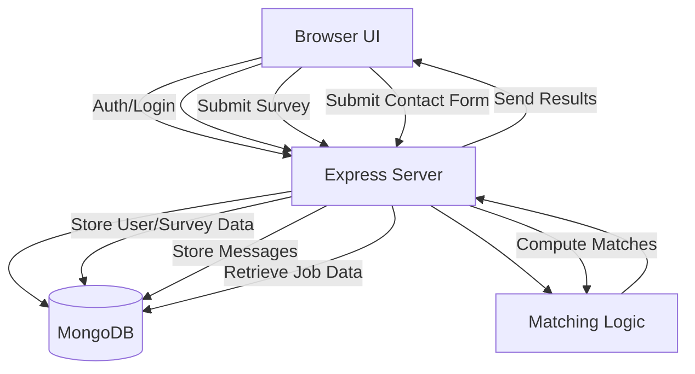
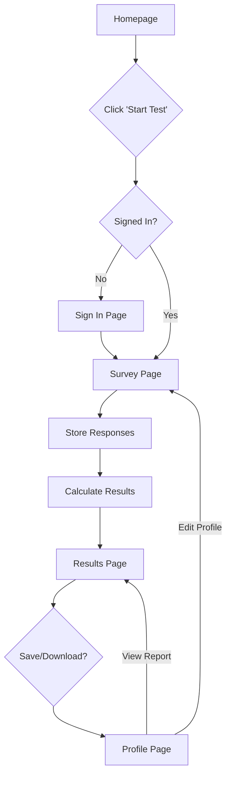

# CareerCompass

## 1. Project Overview

CareerCompass is a web application designed to help undergraduate students discover suitable career paths. The application collects user data regarding education, technical and soft skills, industry interests, and personality type (MBTI) through an interactive assessment. It processes this data to output top career matches accompanied by detailed explanations, salary insights, and identification of skill gaps. The primary goal is to provide actionable career recommendations to students who feel uncertain about their post-graduation path.

## 2. Product Features (By Webpage)

### Homepage
*   **Status**: Implemented.
*   **Purpose**: Landing page to introduce value propositions and entry point for the assessment.
*   **Key UI/UX**: Hero section with call-to-action, value cards, "How It Works" steps, and sample deliverables.
*   **Interactions**: Navigation links, "Start Career Match Test" button (Redirects to Sign In if guest).

### FAQs Page
*   **Status**: Implemented.
*   **Purpose**: Address common user questions about the assessment method and privacy.
*   **Key UI/UX**: Clean list of questions and answers.

### Contact Us Page
*   **Status**: Implemented.
*   **Purpose**: Allow users to reach out for support or feedback.
*   **Key UI/UX**: Split layout with contact info and submission form.
*   **Backend Dependencies**: `POST /contact`.

### Sign In Page
*   **Status**: Functional (Login/Register/Log Out).
*   **Purpose**: User authentication.
*   **Key Interactions**: Login form, link to registration (Toggle), Global Log Out.

### My Profile Page
*   **Status**: Functional (Data Fetching Implemented).
*   **Purpose**: View and manage user data and past assessment results.
*   **Key UI/UX**: Dashboard view of user attributes, Skills Snapshot, Interest Overview.
*   **Features**: View Report, Download Report (Auto-Print), Edit Profile (Retake Survey).

### Career Survey Page
*   **Status**: Functional Prototype.
*   **Purpose**: Collect user data for the matching algorithm.
*   **Key UI/UX**: Multi-step or single-page form with autocomplete fields for majors and skills.
*   **Backend Dependencies**: `POST /survey` to save responses (updates user profile).

### Results Page
*   **Status**: Functional Prototype (Redesigned).
*   **Purpose**: Display algorithmic recommendations.
*   **Key UI/UX**: Column-based "Card Comparison" layout showing Match %, Salary, Potential, Competition, and Skill Analysis.
*   **Backend Dependencies**: `GET /recommendations/:userId`.

## 3. Tech Stack

### Frontend
*   **HTML/CSS/JavaScript**: Chosen for a lightweight, responsive layout without the overhead of heavy frameworks for this prototype phase.

### Backend
*   **Node.js + Express**: Efficient handling of API requests and JSON data processing.

### Database
*   **MongoDB**:
    *   **Rationale**:
        *   Flexible schema accommodates varying career data structures.
        *   Native compatibility with JSON objects used in the application.
        *   Supports rapid prototyping and evolving data models easier than rigid SQL tables.

## 4. System Architecture Diagram



## 5. User Workflow Diagram



## 6. Database Design

### Collections

**Users**
*   `_id`: ObjectId
*   `email`: String (Unique, Sparse)
*   `password`: String
*   `name`: String
*   `education`: String
*   `major`: Array[String]
*   `technical_skills`: Array[String]
*   `soft_skills`: Array[String]
*   `industry`: String
*   `work_type`: Array[String]
*   `mbti`: String

**Jobs (Careers)**
*   `title`: String
*   `industry`: String
*   `education_required`: String
*   `technical_skills`: Array[String]
*   `soft_skills`: Array[String]
*   `salary_range`: Object (min, max)
*   `market_demand`: String
*   `growth_rate`: Number

**Contact**
*   `name`: String
*   `message`: String
*   `date`: Date

## 7. Matching Algorithm

The system uses a rule-based weighted scoring approach:

*   **Mechanism**: Compares user attributes against career requirements.
*   **Weighted Factors**:
    *   **Skills Match** (High Weight): Overlap of technical and soft skills.
    *   **Education**: Minimum education level check.
    *   **Interest Alignment**: Industry and work type (Tech/Non-tech) preferences.
    *   **MBTI Compatibility**: Matching personality type against role suitability.
*   **Output**: Top 3 career matches with detailed skill gap analysis (Skills user has vs. skills user needs).

## 8. Installation and Setup

1.  **Install Dependencies**:
    ```bash
    npm install
    ```

2.  **Start MongoDB**:
    Ensure Docker or local MongoDB is running on port 27017.
    ```bash
    docker run -d -p 27017:27017 --name my-mongo mongo:latest
    ```

3.  **Run Locally**:
    ```bash
    npm run dev
    # OR
    node server.js
    ```
    Server runs on `http://localhost:3001` (default).

## 9. Implementation Status

**Project Complete**: All core features and UI refinements are implemented.
*   **Auth**: Login/Register/Logout functional.
*   **Core Flow**: Survey -> Algorithm -> Results functional.
*   **Pages**: Home, Profile, Results, FAQ, Contact fully styled and linked.
*   **Database**: User, Career, Contact collections active.
